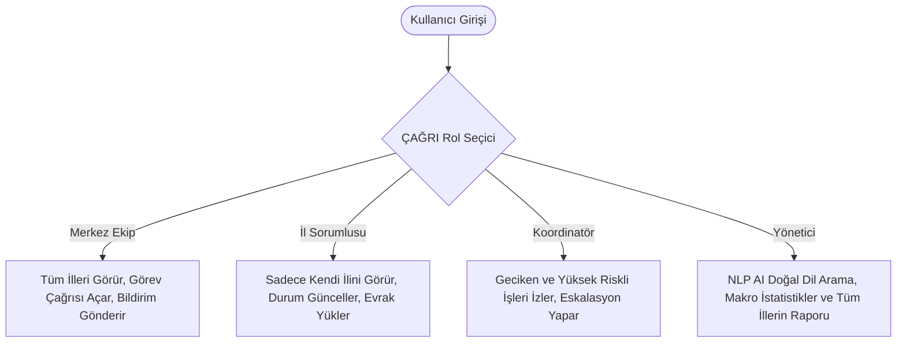

# 🚀 ÇAĞRI
### T3 Vakfı & DENEYAP Görev Takip, Karar Destek ve Operasyon Radarı

> **"Sahadan merkeze kesintisiz iletişim, anlık görev çağrısı ve proaktif yapay zekâ radarı."**  
> **ÇAĞRI**, T3 Vakfı bünyesindeki DENEYAP Türkiye Atölyeleri'nin tüm saha operasyonlarını; Rol Tabanlı Güvenlik Mimarisi (RBAC), Yapay Zekâ Destekli Risk Tahminleme, Doğal Dil İşleme (NLP) Arama Motoru ve Otonom Bildirim Eskalasyonu ile tek merkezden yöneten yeni nesil bir operasyonel koordinasyon platformudur.

---

## 💡 Neden "ÇAĞRI"?
* **Görev Çağrısı**: Merkezin 81 ildeki atölyelere ilettiği anlık aksiyon ve operasyon talepleri.
* **Destek & Eskalasyon Çağrısı**: Geciken, tıkanan veya kritikleşen işlerde WhatsApp ve E-posta üzerinden otomatik tetiklenen operasyonel alarm.
* **Yapay Zekâ Radarı**: Riskleri önceden sezip yöneticilere proaktif karar alma çağrısı yapan karar destek motoru.

---

## 📌 1. Projenin Amacı ve Çözülen Problem

### 🎯 Problem
Türkiye genelinde 81 ilde yaygınlaşan DENEYAP Teknoloji Atölyeleri'nde malzeme tedariki, envanter sayımı, eğitmen koordinasyonu ve TEKNOFEST hazırlıkları gibi yüzlerce eşzamanlı saha operasyonu yürütülmektedir.
* Görev terminlerinin takip edilememesi ve gecikmelerin geç fark edilmesi,
* Merkez ile il sorumluları arasındaki iletişim kopukluğu,
* İl bazlı veri gizliliği ve rol karmaşası,
* Evrak, şartname, fatura ve ZIP arşivlerinin dağınık platformlarda kaybolması,
operasyonel verim kaybına ve kaynak israfına sebep olmaktadır.

### 💡 Çözüm: ÇAĞRI
**ÇAĞRI**, merkez ekip ile 81 il sorumlusu arasındaki duvarları kaldırır:
1. **Görevleri anlık olarak illere düşürür** (Reaktif Atama & İniş Animasyonu).
2. **Gecikme risklerini yapay zekâ ile önceden hesaplar** (Proaktif Risk Skorlaması).
3. **Otonom bildirim kanallarıyla aksiyon aldırır** (WhatsApp & E-posta Eskalasyonu).
4. **Tüm evrak, tutanak ve arşiv dosyalarını görev kartı üzerinde güvenle saklar**.

---

## 🏗️ 2. Sistem Mimarisi ve Teknoloji Yığını

| Katman | Teknoloji / Kütüphane | Rolü & Katkısı |
|---|---|---|
| **Arayüz (Frontend)** | React 18 (Vite) | Bileşen bazlı, ultra hızlı ve reaktif tek sayfa mimarisi (SPA) |
| **Stil & Tasarım Dili** | Tailwind CSS | T3 kurumsal kırmızısı (`#E30A17`), ferah dashboard (`bg-slate-50`) |
| **Animasyon & UX** | Framer Motion | Pürüzsüz geçişler, yeni görev düşme animasyonları, toast bildirimleri |
| **İkonografi** | Lucide React | Modern, kurumsal ve optimize SVG ikon altyapısı |
| **Güvenlik (RBAC)** | Role-Based Access Control | İl ve rol düzeyinde katı veri izolasyonu ve yetki denetimi |
| **Backend & Veri** | Mock Firestore & State Engine | Reaktif veri akışı, asenkron bildirim ve dosya kuyruğu simülasyonu |

---

## 🔐 3. Siber Güvenlik ve RBAC (Rol Tabanlı Yetkilendirme) Mimarisi

ÇAĞRI, en az yetki (*Principle of Least Privilege*) prensibine göre kurgulanmış **4 temel kullanıcı rolüne** sahiptir. Sunum ve jüri testleri için sağ üstte **Canlı Rol Değiştirici (Role Switcher)** yer alır:



### Rol Yetki Matrisi

| Yetki / Aksiyon | Merkez Ekip (`merkez_ekip`) | İl Sorumlusu (`il_sorumlusu`) | Koordinatör (`koordinator`) | Yönetici (`yonetici`) |
|---|:---:|:---:|:---:|:---:|
| **Tüm İllerin Görevlerini İzleme** | ✅ | ❌ *(Yalnızca Kendi İli)* | ✅ *(Risk / Gecikme Filtreli)* | ✅ |
| **Yeni Görev Oluşturma & İle Atama** | ✅ | ❌ | ❌ | ❌ |
| **Görev Durumu Güncelleme** | ✅ | ✅ | ❌ | ❌ |
| **WhatsApp / E-posta Bildirimi Gönderme** | ✅ | ❌ | ✅ | ❌ |
| **Evrak & ZIP Yükleme / İndirme** | ✅ | ✅ | ✅ | ✅ |
| **AI Karar Destek & Doğal Dil Arama** | ✅ | ❌ | ❌ | ✅ |
| **Dinamik İl Seçip Test Etme** | — | ✅ *(Örn: Ankara, Trabzon)* | — | — |

---

## ⚡ 4. ÇAĞRI'nın Temel Çalışma Mantığı ve Modülleri

### 1️⃣ Anlık Görev Çağrısı ve Reaktif İle Düşme
* **Merkez Ekip** yeni bir görev oluşturup hedef ili seçtiğinde görev anında sisteme kaydedilir.
* Sayfanın tepesinde parıltılı **"YENİ GÖREV ATANDI!"** animasyonlu banner'ı açılır.
* Görev kartı ilgili panoya yumuşak bir yay (*spring*) animasyonuyla düşer ve üzerinde **"YENİ"** rozeti parlar.
* **İl Sorumlusu** rolüne geçildiğinde, seçili ilin panosunda yeni atanan görev anlık olarak hazır bekler.

### 2️⃣ Yapay Zekâ ve Karar Destek Çubuğu (NLP & Risk Motoru)
* **Doğal Dil Arama (NLP)**: Yönetici ve Merkez Ekip, karmaşık filtreler yerine konuşma diliyle sorgu yapabilir:
  * *"Trabzon'daki gecikenleri getir"*
  * *"Kritik öncelikli görevler"*
  * *"Yüksek riskli görevleri listele"*
* **Proaktif Risk Rozetleri**: Yapay zekâ termin yakınlığı ve görev önceliğine göre dinamik risk skoru hesaplar:  
  `AI Tahmini: %92 Gecikme Riski` rozetiyle kriz oluşmadan müdahale imkânı sağlar.

### 3️⃣ Akıllı Renk Kodlu Termin Sistemi
* **Geciken Görevler**: Kırmızı kenarlık, kırmızı uyarı rozeti (`X gün gecikti`).
* **Yaklaşan Görevler (≤ 2 Gün)**: Turuncu kenarlık, turuncu rozet (`Bugün son gün!` veya `X gün kaldı`).
* **Normal Görevler**: Standart kurumsal görünüm (`X gün kaldı`).

### 4️⃣ Otonom Çok Kanallı Bildirim Sistemi
* **WhatsApp Bildirimi**: Kart detayından tek tıkla sahadaki il sorumlusuna simüle edilmiş WhatsApp mesajı gönderilir.
* **E-posta Eskalasyonu**: Geciken işlerde üst yönetime eskalasyon maili fırlatılır.
* **Anlık Toast Geri Bildirimi**: Bildirim gönderildiğinde sağ altta animasyonlu onay kutusu çıkar; kartta `WhatsApp Gönderildi ✓` statüsü işaretlenir.
* **Bildirim Zil Paneli**: Header'daki zil butonuna basıldığında tüm sistem bildirimleri zaman damgalı log olarak incelenebilir.

### 5️⃣ Evrak & ZIP Dosya Yönetim Sistemi
* Her görev kartının genişletilebilir detay panelinde modern bir **sürükle-bırak** dosya alanı bulunur.
* **Desteklenen Dosyalar**:
  * 📄 **PDF / Belgeler**: Teknik şartnameler, izin yazıları, faturalar
  * 📦 **ZIP / RAR / 7Z**: Kod arşivleri, toplu fotoğraflar, proje paketleri
  * 📊 **XLSX / CSV**: Bütçe ve envanter tabloları
  * 🖼️ **Görseller**: Atölye durum fotoğrafları, yarışma afişleri
* Dosya boyutları otomatik hesaplanır (`KB`, `MB`), kart üzerinde **"📎 2 dosya"** rozeti görüntülenir; indirme ve silme aksiyonları mevcuttur.

---

## 🔄 5. Uçtan Uca Operasyonel Senaryo (Örnek Akış)

```
[1. ADIM] Merkez Ekip ÇAĞRI Başlatır:
         "Trabzon Atölyesi 3D Yazıcı Bakımı" -> Hedef İl: Trabzon -> Öncelik: Kritik
         
[2. ADIM] Anlık Dağıtım:
         Sistemde "Yeni Görev Atandı!" animasyonu patlar, görev Trabzon panosuna düşer.
         
[3. ADIM] İl Sorumlusu Girişi:
         Kullanıcı rolünü 'İl Sorumlusu' (Trabzon) yapar. Görevi görür,
         Servis formunu (PDF/ZIP) karta yükler ve durumu "Devam Ediyor" yapar.
         
[4. ADIM] AI Risk & Gecikme Algılama:
         Termin tarihi yaklaşır veya geçerse AI Risk rozeti %85+ seviyesine çıkar.
         
[5. ADIM] Koordinatör / Merkez Müdahalesi:
         Koordinatör gecikmeyi görür, "WhatsApp Gönder" ve "E-posta Eskalasyonu" butonuna basar.
         Sorumluya anında uyarı iletilir, log geçmişine kaydedilir.
```

---

## 💻 6. Kurulum ve Çalıştırma

Projeyi yerel ortamda çalıştırmak için:

```bash
# 1. Proje dizinine gidin
cd "Yapay zeka yarışması"

# 2. Bağımlılıkları kurun
npm install

# 3. Geliştirme sunucusunu başlatın
npm run dev
```

Tarayıcınızdan **`http://localhost:5173/`** adresine giderek uygulamayı canlı deneyimleyebilirsiniz.

---

## 🎨 7. UI/UX Tasarım İlkeleri

* **T3 Kırmızı Vurgusu (`#E30A17`)**: Marka kimliğini temsil eden dinamik odak rengi.
* **Minimalist & Sade Zemin (`bg-slate-50`, `bg-white`)**: Operasyonel karmaşayı önleyen temiz dashboard.
* **Pürüzsüz Etkileşimler**: Framer Motion tabanlı yay efektleri, mikro animasyonlar ve okunabilir tipografi.
* **Çift Görünüm Modu**: Kanban panosu ve detaylı liste görünümü arasında tek tıkla geçiş.

---

## 🏆 8. Sunumda Vurgulanacak 5 Güçlü Yön (Jüri Notları)

1. **İsim ve Misyon Uyumu ("ÇAĞRI")**: Görev çağrısından eskalasyon çağrısına kadar tüm operasyonel iletişimi tek isimde somutlaştırır.
2. **Gerçek Hayat Problemini Çözmesi**: DENEYAP atölyelerinin 81 ildeki sahadan merkeze operasyonel haberleşme darboğazını doğrudan çözer.
3. **Katı RBAC Güvenliği**: İl sorumlusu başka bir ilin verisine erişemez; rollere göre yetki sınırları tam olarak uygulanmıştır.
4. **Proaktif Karar Desteği (AI)**: Olaylar geciktikten sonra değil, gecikmeden önce risk skoru üreterek aksiyon aldırır.
5. **Çok Kanallı Eskalasyon & Evrak Arşivi**: WhatsApp, e-posta ve evrak/ZIP arşivini tek ekranda buluşturur.

---
*Geliştirici: T3 Vakfı Operasyon Teknolojileri Geliştirme Ekibi — Proje: ÇAĞRI*
